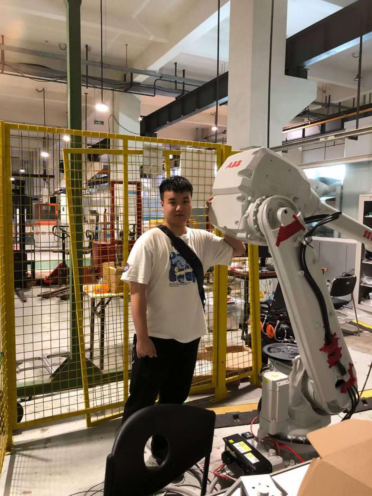

# Social Robot Design Portfolio

## Table of Contents
- [Team Introduction](#team-introduction)
- [Group Work](#group-work)
  - [Case Description](#case-description)
  - [Selection of Useful Design Tools](#selection-of-useful-design-tools)
  - [Mindmap of Problem Space](#mindmap-of-problem-space)
  - [Potential Building Blocks](#potential-building-blocks)
  - [Functional Breakdown](#functional-breakdown)
  - [Potential Experimental Approach](#potential-experimental-approach)
  - [Pitch / Slide](#pitch-slide)
- [Reflections](#reflections)
  - [How is Design Research linked to HRI](#how-is-design-research-linked-to-hri)
  - [Digital (AI) vs Embodiment](#digital-ai-vs-embodiment)
  - [Why is "HER" (not) a Compelling Argument?](#why-is-her-not-a-compelling-argument)
  - [The Robot Revolution: When?](#the-robot-revolution-when)
  - [Reflection: The Dinosaur Hotel](#reflection-the-dinosaur-hotel)
  - [Reflection: Nabaztag](#reflection-nabaztag)
  - [Reflection: Cuddlebits](#reflection-cuddlebits)
  - [Reflection: Be-Right-Back](#reflection-be-right-back)

---

## About Me

| Member | Photo | Brief Introduction | Personal Page |  
|:------:|:-----:|:----------:|:------------------:|
| **Kaiwen Lu** |  |  Master student in Robotics at the University of Twente. Background in Mechanical Engineering from Shanghai Jiao Tong University. Experienced in control systems, SLAM, robot navigation, and 3D modeling. Passionate about human-robot interaction, mechatronics design, and AI applications in robotics.  | [Link](./personalPage/Kaiwenlu_CV_Eng.pdf)  |

---

## Group Work

### Case Description
*(To be added)*

### Selection of Useful Design Tools
*(To be added)*

### Mindmap of Problem Space
*(To be added)*

### Potential Building Blocks
*(To be added)*

### Functional Breakdown
*(To be added)*

### Potential Experimental Approach
*(To be added)*

### Pitch / Slide
*(To be added)*

---

## Reflections

### How is Design Research linked to HRI
*(To be added)*

### Digital (AI) vs Embodiment
*(To be added)*

### Why is "HER" (not) a Compelling Argument?
*(To be added)*

### The Robot Revolution: When?
*(To be added)*

### Reflection: The Dinosaur Hotel
*(To be added)*

### Reflection: Nabaztag
*(To be added)*

### Reflection: Cuddlebits
*(To be added)*

### Reflection: Be-Right-Back
*(To be added)*

---

> This portfolio is developed collaboratively by our project team.  
> All contents will be updated during the project progress.
