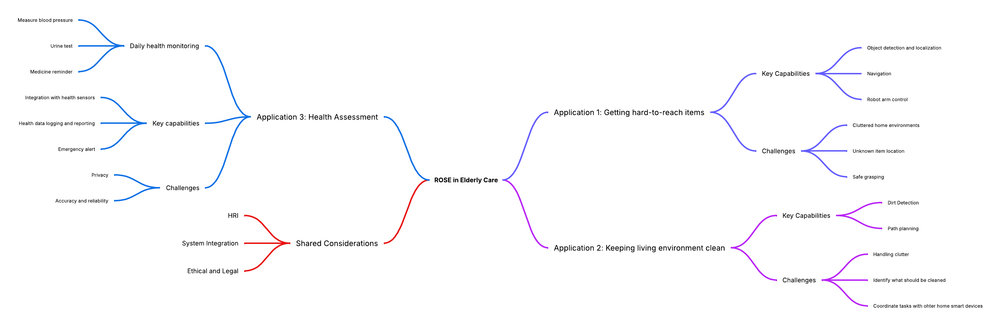

# Social Robot Design Portfolio

---

## About Me

| Member | Brief Introduction | Personal Page |  
|:------:|:----------:|:------------------:|
| **Kaiwen Lu** | Master student in Robotics at the University of Twente. Background in Mechanical Engineering from Shanghai Jiao Tong University. Experienced in control systems, SLAM, robot navigation, and 3D modeling. Passionate about human-robot interaction, mechatronics design, and AI applications in robotics.  | [CV](./Kaiwen_Lu_CV.md)  |

---

## Group Work

<strong> Case : ROSE </strong>

### Case Description
ROSE (Robot Operating System Environment) is a social robot development platform based on ROS, often using the TIAGo robot manufactured by PAL Robotics as its hardware foundation. TIAGo is a multifunctional robot that integrates a mobile base, robotic arm, elevating torso, and a variety of sensors (such as lidar, RGB-D cameras, etc.), and is widely used in research, education, and human-robot interaction fields. 

#### Existed Functions and Scenario Analysis
##### Stories/narratives in media and project data & Currently developed scenarios
Narratives/themes identified: 

(1) Intentional vs Unintentional Obstruction: A recurring narrative involves distinguishing between human behaviors that are socially intentional (e.g., trying to engage with the robot) vs unintentional (e.g., unaware obstruction).

(2) Navigation in constrained environments: Especially in healthcare settings like hospital corridors, robots face complex human-robot interaction scenarios.

(3) Social cues as interaction triggers: Stories often revolve around the robot interpreting gaze, movement hesitation, and posture as signals of human intent

Application Scenarios

(1) Logistics: ROSE delivering samples or items in hospital environments while interacting with or avoiding people.

(2) Companionship/personal assistance: Visitors engaging intentionally with the robot out of curiosity or for help.

(3) Health/nutrition advice: Potential future use cases hinted through the broader categories in the tool list.
#### Our case
Our case is to apply the ROSE robot in elderly care to accomplish three applications. These three applications are respectively: helping the elderly obtain things that are difficult to get; Keep the living environment clean and tidy. And also assist the elderly in conducting self-assessment of their own health status: such as measuring blood pressure every morning, conducting urine tests, and other behaviors.

---
### Selection of Useful Design Tools

  
#### Senario Analysis
References:

(1) Through the dual-track deduction of the best scenario and the worst scenario, break through the linear prediction model, and systematically simulate the development paths of positive and negative extremes that deviate from the long-term trend; (2) Based on the dynamic correlation analysis between key influencing factors and the goals, guide participants to independently develop differentiated future scenarios and form strategic predictions covering the possibility spectrum; (3) Taking the preset scenarios as the creative anchor points, drive participants to transform abstract variables into specific action strategies, achieving decision support from risk contingency plans to opportunity capture. This method effectively balances the rigor and innovative tension of strategic planning by structuring the imaginative space. [Busse T, Kernebeck S, Nef L, Rebacz P, Kickbusch I, Ehlers J
Views on Using Social Robots in Professional Caregiving: Content Analysis of a Scenario Method Workshop
J Med Internet Res 2021;23(11):e20046](https://www.jmir.org/2021/11/e20046/)

#### Story Boarding
References:

Through a case of medical caring team with patients, doctors and robots, we are informed that: Through the visual narrative framework, the multiple perspectives of caregivers, patients and medical staff are integrated to transform abstract needs into concrete scenarios (such as daily auxiliary scenarios), revealing the potential paths of technological intervention. The core significance lies in breaking through the limitations of traditional demand research, using co-created storyboards to stimulate participants' imagination of robot application scenarios, simultaneously capturing functional requirements and humanistic care demands, providing a decision-making basis that takes into account both practicality and emotional adaptability for technical design, and ultimately achieving a precise connection between technological innovation and real user needs. [B. Sienkiewicz, Z. Radosz-Knawa and B. Indurkhya, "A participatory design approach to using social robots for elderly care*," 2024 IEEE International Conference on Advanced Robotics and Its Social Impacts (ARSO), Hong Kong, 2024, pp. 194-199, doi: 10.1109/ARSO60199.2024.10557812.](https://ieeexplore.ieee.org/abstract/document/10557812)

#### Wizard of Oz
References:

Wizard of Oz, through the design of restricted perception experiments, simulates the perception and behavioral limitations in the real interaction scenarios of robots, enabling human experts (" guides ") to dynamically generate interaction strategies based only on the limited information available to robots. By limiting the perception range of the guide (aligning with the sensor capabilities of the robot), the non-portability of the strategy caused by the "omniscient perspective" of human experts in traditional methods is avoided, and the adaptability of the strategy to the actual capabilities of the robot is improved. The interaction behavior data collected under restricted conditions can be directly transformed into the autonomous control logic of the robot, reducing the "reality gap" in the subsequent algorithm development. [P. Sequeira et al., "Discovering social interaction strategies for robots from restricted-perception Wizard-of-Oz studies," 2016 11th ACM/IEEE International Conference on Human-Robot Interaction (HRI), Christchurch, New Zealand, 2016, pp. 197-204, doi: 10.1109/HRI.2016.7451752.](https://ieeexplore.ieee.org/abstract/document/7451752)

#### Lego Series

---

### Senarios

For the interaction between users and robots to be appropriate and sustainable, it is necessary to reduce the influence of uncertainty and negative emotions. Therefore, in addition to the robot's own understanding ability of semantics, it is also necessary to consider different scenarios where users have varying levels of trust in the robot.
[Miller Linda , Kraus Johannes , Babel Franziska , Baumann Martin, "More Than a Feeling—Interrelation of Trust Layers in Human-Robot Interaction and the Role of User Dispositions and State Anxiety," 2021 Vol12 Frontiers in Psychology, doi:10.3389/fpsyg.2021.592711](https://www.frontiersin.org/journals/psychology/articles/10.3389/fpsyg.2021.592711
)
#### Low user trust/low robot understanding:
70-year-old Bob was influenced by science fiction movies and believed that robots were villains who would rule the earth, so he did not trust and was afraid of robots.
Bob felt uncomfortable in his heart and sat on the sofa, holding his chest and breathing, but did not speak. The robot could not recognize the meaning of Bob's subtle movements and thought that Bob was dancing, and began to ask Bob if he needed to play music to accompany him.
Bob said sarcastically, "You are so smart", and the robot responded, "Thank you for the compliment, I will continue to work hard"

Problems with this scenario response:
The robot lacks "micro-movement" and "micro-expression" recognition, cannot understand the intention represented by human movements, lacks a model for emotional context analysis, and cannot recognize the emotions expressed by humans through voice intonation.

#### High user trust/low robot understanding:
One early morning, Grandma Zhang, as usual, used the ROSE robot for a health checkup. She voluntarily put the blood pressure monitor on her arm and said, "Little R (the robot's nickname), measure my blood pressure for me." The robot detected Grandma Zhang's action of holding the blood pressure monitor through the camera but mistakenly confused it with her daily action of "holding a water cup" (Note: The blood pressure monitor and water cup have similar shapes), and thus responded, "Sure, I'm pouring water for you." It then moved its mechanical arm to try to take the blood pressure monitor. 
Grandma Zhang was taken aback for a moment and explained with a smile, "It's not a water cup, it's for measuring blood pressure!" The robot received the keyword "blood pressure" and triggered the preset process, but failed to correctly associate it with the current situation (the arm was already wearing a blood pressure monitor). Instead, it broadcasted the blood pressure history data from last week: "Your average blood pressure last week was 125/80 mmHg." Meanwhile, the mechanical arm was still trying to grasp the blood pressure monitor, causing it to fall off. 
Grandma Zhang wasn't angry. Instead, she patiently repeated, "Little R, you haven't measured it today. You need to measure the new one first." The robot recognized the keyword "measure" again and started the default "environmental detection" mode. It scanned the room with a laser radar and reported, "The current room temperature is 26 degrees Celsius and the air quality is good." Grandma Zhang shook her head helplessly and measured her blood pressure manually. She comforted the robot, "It's okay. Try again tomorrow. You'll get it after a few more times."

Problems with this scenario response:
Weak object detail recognition: Unable to distinguish the binding strap/texture features of a blood pressure monitor from those of a water cup. 
Task chain disruption: Isolated response to the keyword "blood pressure", ignoring the coherent logic of "wearing the device - measurement - recording". 
Trust backfires: Users' excessive tolerance of errors delays the timeliness of health monitoring.

#### Low user trust/high robot understanding:
68-year-old Mary has a stubborn personality and is strongly resistant to new technology. Her daughter, who lives in another city, bought her a new type of care robot and persuaded her to use it. Mary reluctantly used the robot to monitor her daily health data, to make her daughter feel at ease.
One night, because the robot had failed to charge successfully during the day, it moved to the charging station by itself at night to try charging again. Since Mary never cared about the robot’s charging behavior, she was frightened by the moving figure in the living room when she got up at night, and fainted for a short time.
Although the robot detected the problem and called her daughter and the nearby medical center in time, and the result showed that Mary’s body was fine, she still refused to keep the robot at home again.

Problems with this scenario response: The robot can rocognize people’s emotion and other data and try to offer help. But users’trust to the robot are so low that even they share the same goal, the users still cannot accept the robot’s help as a daily routine.

---

### Overview Design

### Mindmap of Problem Space

### Potential Building Blocks
#### Perception and Sensing
- Camera
- Lidar
- Microphone/Speaker
- Medical Sensors
#### Robot Mobility & Manipulation
- Arm Manipulation
- Mobile Control
#### Human-Robot Interaction
- NLP
- Touchscreen interface
#### Alert System
#### System integration

### Functional Breakdown
#### Assist in Retrieving Objects
- Environment Perception and Object detection
- Understand Human Commands
- Navigation
- Manipulate and Retrieve object
- Deliver Object to Elderly

#### Maintain clean and tidy environment
- Detect Mess / Dirt / Items Out of Place
- Plan Cleaning or Tidy Task
- Simple Manipulations
- Navigation

#### Support Daily Health Self-Assessment
- Prompt and Guide Elderly
- Integrate with Medical Devices
- Record and Analyze Results
- Communicate with Caregiver if Needed

### Potential Experimental approach
#### Verify that robot can complete tasks autonomously
#### Evaluate naturalness, trust, and ease of use
#### Observe learning curve and routine integration

| Aspect                | Metric/Tool                            |
| --------------------- | -------------------------------------- |
| Task performance      | Task success rate, time, failure modes |
| HRI usability         | SUS, NASA TLX, interaction steps       |
| Trust & acceptance    | Almere Model Questionnaire             |
| Speech recognition    | Command success rate, retry frequency  |
| Grasping accuracy     | Grasp success rate, misplacement rate  |
| System robustness     | Downtime, recovery from error          |
| Data privacy handling | Consent protocol, encryption logs      |

### Pitch / Slide

---

---
### Expressiveness
observation of paper-puppeteering：

observation recording: https://youtu.be/jthQCp5BSxM

01
Action description: Swing left and right at a constant speed, then jump for 5 seconds and then jump in place at a very fast speed
Guess: excited

02
Action description: Hit the ground with the head at a constant speed and then swing left and right at a constant speed
Guess: The robot wants to express its needs

03
Action description: Quickly retreat in place
Guess: The robot wants to walk with me

04
Action description: The body leans to the right and maintains this action
Guess: Thinking

05
Action description: Sprint forward at a very fast speed
Guess: The emotion is hate

06
Action description: The whole body flips over, imitating a human lying on the ground, or slowly lowering the head
Guess: Sad emotion

LED:

1. Emotional expression and feedback: Express emotions by controlling the combined shape, color and flashing frequency of LED.
Application:
Blue eyes + slow flashing + smiling shape or circle - Indicates that the robot is in a calm state (no task mode), and slow blinking indicates friendly attention to humans and is ready to communicate with humans at any time
Red eyes + rapid flashing + triangle shape - When the robot detects danger and issues a warning, the eyes turn red and flash quickly to attract the user's attention

2. Health monitoring and reminders: Use LED eye changes to remind the elderly of daily health matters, such as taking medicine, drinking water, resting, etc.
Application:
Green eyes - Indicates that the elderly are in good health. When the elderly complete their daily walking goals or take medicine on time, the green eyes flash slowly to encourage
Red eyes - For example, when the elderly miss medication or bedtime, the eyes turn red and flash quickly (slower than when prompting danger signals to distinguish)

#### A tool* for expressiveness
EMO-CUE is a multimodal, low-threshold prototype expression toolbox, consisting of the following components:

##### Expressive Cue Cards

Each card represents an emotion/intention state (such as "I'm listening to you", "I need help", "I'm worried about you"), and the back of the card gives suggestions for multimodal expression combinations:

Light color changes (such as red → anxiety, blue → calm, orange → need interaction)

Vibration or tactile feedback (continuous/pulse rhythm)

Small movement patterns (head turn/backward/forward)

Voice intonation fragments (non-semantic "hmm~", "hiss~", etc.)

##### Hardware modules/low-fidelity prototypes

Use programmable Arduino or micro:bit to control small motors (express retreat), RGB lights (express state changes), and buzzers (simulate intonation).

Allow users to quickly combine and test interactive expressions by mapping cards → modules.

##### Improvisational Scenarios

Provide nursing scenario scripts, such as "elderly hesitant to take medicine", "robot notices user falls", "robot prompts relatives to call via video", etc. Participants use the EMO-CUE tool to interpret robot roles with expressive actions without using language.

---

### Design Behavior  
**Function: Helping with hard-to-reach items, cleaning, and health self-assessment**

---

####  Scenario 1: Helping Reach High or Low Items

**Dialogue**  
> "Yes, it's on the top shelf," said the elderly person.  
> The robot extended its arm, looked up to the cabinet, grasped the item carefully, and handed it to the user with a smile.

**Involved Technologies**  
- `Speech recognition`  
- `LLM + context understanding`  
- `Visual input & scene understanding`  
- `Object localisation`  
- `Vision-based grasping & manipulation`  
- `Motion planning`  
- `Human-robot interaction & gesture coordination`  
- `Affective computing (smile, polite gesture)`

---

####  Scenario 2: Keeping the Environment Clean

**Dialogue**  
> "The floor seems dusty today," the resident commented.  
> The robot activated its vacuum module, scanned the room, navigated around the furniture, and started cleaning.  
> "Done! The room is clean now," it announced.

**Involved Technologies**  
- `Speech recognition`  
- `LLM (intent understanding)`  
- `SLAM (localisation and mapping)`  
- `Path planning & obstacle avoidance`  
- `Dust detection (semantic segmentation)`  
- `Vacuum actuation control`  
- `Affective feedback (speech & tone modulation)`

---

####  Scenario 3: Measuring Blood Pressure

**Dialogue**  
> "Could you check my blood pressure, please?"  
> The robot retrieved the BP cuff, wrapped it gently around the user’s arm, initiated the measurement, and read the result aloud.

**Involved Technologies**  
- `Speech recognition`  
- `LLM (command understanding)`  
- `Manipulation & touch-sensitive actuation`  
- `Biosensor integration (BP monitor control)`  
- `Real-time data acquisition`  
- `Voice synthesis (result announcement)`  
- `Context tracking (session continuity)`

---

####  Scenario 4: Urine Test Analysis

**Dialogue**  
> "I’ve just placed the sample."  
> The robot detected the container, moved it into the analysis bay, and displayed the result on the screen: "All values normal today."

**Involved Technologies**  
- `Speech recognition & intent parsing`  
- `Object detection & classification`  
- `Grasping & manipulation (careful handling)`  
- `Lab-on-robot analysis module integration`  
- `Visual display & voice feedback`  
- `Context awareness (health logs, timestamping)`

---

####  Scenario 5: Logging and Reporting Results

**Dialogue**  
> "Please send the result to my daughter."  
> The robot encrypted the report and uploaded it securely to the connected caregiver app.

**Involved Technologies**  
- `LLM (command parsing)`  
- `User profile management`  
- `Secure data logging & transmission`  
- `Cloud integration`  
- `Role-aware access control`  
- `Affective computing (respectful tone and privacy handling)`

---

### Sustainability and ethics
Envisioning Cards are a practical design tool developed to translate complex theoretical concepts—especially from Value Sensitive Design (VSD) and Multi-lifespan Design (MLD)—into concrete actions for designers. [Yoo, Daisy and Logler, Nick and Ballard, Stephanie and Friedman, Batya, "Multi-lifespan Envisioning Cards: Journeying from Design Theory to Tools for Action,"2022, Association for Computing Machinery](https://dl.acm.org/doi/pdf/10.1145/3532106.3533495)
By applying the four aspects of the envision card: Changing Hands, Environmental Sustainability, The Long Now, Work of the Future, we can consider the ethical issues of robots and their relationship with people during the design process.

#### Changing Hands
An elderly care robot may become a family heirloom, taking care of the elderly in the family for generations. In this case, users may regard this robot as a member of the family, which means that during the design process, the robot may need to store the process of getting along with the family members, so that it can behave like the elder of the family in the process of taking care of people. At the same time, it needs to be able to transfer memory relatively easily to cope with the replacement. And the hardware is preferably modularized to facilitate the replacement of damaged parts.
If the robot is sold as a second-hand product, it also needs to protect the privacy of the original owner. This requires clearing the behavior mode set locally or encrypting the user account of the server, otherwise the information will be leaked after it is sold second-hand or stolen, threatening the personal safety of the old owner.

#### The Long Now

According to the envision cards "The Long Now", we envision a 50-year old who has interacted with the robot over a lifetime, and will continue to interact with the robot in the next few decades, with a five-year period:
At the age of 50, the robot intervenes in life as a practical tool, but not a core part of life. By the age of 55, the elderly have become accustomed to the company of the robot and begin to rely more on the robot for daily reminders and health monitoring. At the age of 60, the elderly may be highly dependent on the robot both physically and emotionally, and the family also fully trusts the robot to take care of the elderly. At the age of 70, the robot even replaces the elderly's existing interpersonal relationships to some extent, weakening personal autonomy and initiative.
The ethical concern highlighted here is that over-reliance on robots may lead to social isolation over time, weakening the connection between people and human communities.
This long-term change needs to be considered in the design stage to ensure that robots complement rather than replace the care of the elderly, and promote relationships between people rather than isolate people's social relationship.
####

####

---

# Reflections

---

<strong> Start</strong>

  
### How is Design Research linked to HRI
Design research, through human-centered approaches, helps to deeply understand the real needs, emotions and behavioral responses of users when interacting with robots. Through observation, interviews and prototype testing, design research reveals details that are often overlooked in traditional technology development, such as trust, natural communication and social acceptance, thereby promoting HRI systems to become more natural, efficient and enjoyable. It prompts the shift of human-robot interaction from "technology-centered" to "experience-centered", achieving better social integration.

### Digital (AI) vs Embodiment
In the design of social robots, digital AI (chatbots) have significant limitations compared to physical robots. Take for example toys that are physical entities. The sense of satisfaction and warmth that one gets from hugging a plush toy is definitely quite different from that of hugging a cold steel block. Not to mention digital AI that has no physical form at all. Robots with physical forms will give users a more intuitive first impression, demonstrating their inherent functions and providing more interaction methods with users. In reality, people's communication involves various senses such as vision, hearing, smell and touch. However, chatbots AI are unable to meet these needs. Or rather, they can only partially observe these aspects of humans in a one-way manner. This can lead to a sense of distrust and communication barriers.

### Why is "HER" (not) a Compelling Argument?
I find it unpersuasive that someone could fall in love with an intangible AI. I myself experienced a long-distance relationship. Although we can now communicate through video calls, it still can't bridge the gap of deepening distrust and estrangement. Eventually, this relationship ended in a breakup.

### The Robot Revolution: When?
When the social productive forces are developing at an extremely rapid pace, and when people not only need robots in the production field but also in terms of quality of life, the robot revolution will arrive.

### The Dinosaur Hotel
The "Dinosaur Hotel" in Japan (Henn na Hotel) initially attracted much attention with its robot receptionists and fully automated services, reflecting people's expectations for future technological hotels. However, the actual operational results were not satisfactory. Many robots were unable to effectively handle complex or unconventional customer demands, such as not being able to understand customers' questions, misidentifying in noisy environments, and lacking the ability to handle emergencies. This led to a decline in guest experience, and eventually the hotel had to rehire a large number of human employees. 
This reflects an important issue: In the service industry, "cool novelty" cannot truly replace "flexibility, empathy and judgment". Although robots have advantages in performing simple and repetitive tasks, when faced with rich and diverse actual scenarios, robots lacking contextual understanding and emotional responses find it difficult to provide satisfactory service experiences. Especially in environments like hotels that emphasize personalized reception and delicate care, purely pursuing efficiency can actually undermine the overall experience of customers.

### Nabaztag
As an early internet-connected pet robot, Nabaztag won the affection of many users in the early stage with its cute appearance and basic internet functions (such as reading the weather, email reminders, swaying ears, etc.). It successfully seized the novel concept of "Internet of Things cute pets", making the interaction between humans and technology more intimate and interesting. However, as time went by, the limitations of Nabaztag gradually became apparent. Its interaction capabilities were limited, updates were slow, and it couldn't continuously meet users' expectations for "companionship" and "intelligence" that were constantly improving. People soon lost interest in simple notifications and mechanical actions, and the lack of emotional deepening connections also made it difficult for them to form a long-term reliance. 
This indicates that in the design of social robots, merely relying on novelty and appearance to attract attention is far from sufficient. What users truly desire is an intelligent companion that can continuously evolve, understand them, and establish emotional connections. When robots fail to grow along with changes in user needs, the initial curiosity will soon fade away, ultimately leading to the abandonment of the product.

### Cuddlebits
Cuddlebits can evoke more resonance and protective instincts in people through subtle movements (such as quivering and curling up) and natural reactions to touch. This "soft and vivid" characteristic makes them more like real small animals, thereby triggering people's instinctive concern and emotional investment. 
This indicates that in the human-machine emotional relationship, "high intelligence" is not the key to touching people's hearts. On the contrary, traits such as being soft, vulnerable, and needing care are more likely to trigger deep emotional connections. The design of Cuddlebits reminds us that truly effective human-machine interaction does not necessarily require complex language and task completion capabilities. Sometimes, a simple, touchable and understandable little being is enough to establish a strong emotional bond.

### Be-Right-Back
The concept of "Be-right-back" originates from the idea of using artificial intelligence technology to "revive" the deceased relatives. For instance, through chat records and social media data, a "digital personality" can be reconstructed. Although this technology can bring comfort to those who have lost their loved ones in the short term, it also raises profound ethical and emotional issues. Firstly, the simulated "existence" is never truly human; it lacks independent growth and genuine emotions. Secondly, this technology may delay the normal mourning process of people, turning sadness into a reliance on false connections. 
This reflection reminds us that technology can reproduce language and behavioral patterns, but it cannot truly replicate the unique and profound emotional relationships between people. In the face of loss, humans need memory and acceptance rather than remaining stuck in a false "farewell" forever. Therefore, although "be-right-back" is tempting from a technical perspective, from the viewpoints of emotional health and ethics, it is not a truly desirable solution.

---

<strong>Story building</strong>

### Sci-fi prototyping
The prototype design based on science fiction novels can easily demonstrate the philosophical contemplations of different people on a certain scientific phenomenon, because novels are ultimately supposed to serve the purpose of shaping the protagonists. As for the plot of the novel, the functions of the prototype of the robot might be described in a more coherent way. However, in science fiction novels, in order to create dramatic conflicts, extreme situations can be simulated. In such cases, the story becomes less credible.

### 21st century robot project
The aspect that most impresses me about this project is that it emphasizes not merely building a "machine" that can move and speak, but creating an "existence" that has a story, a motivation, and can be understood and accepted by humans. In my view, this design approach of robots with personality shaping and social role setting is the key that distinguishes social robots from traditional automated devices. 
It also made me reflect that perhaps we are too prone to equate "high intelligence" with "good robots"? Maybe a little robot that can understand your silence and quietly accompany you when you are down is far more meaningful in reality than an "intelligent butler" that can solve complex mathematical problems. This project reminds me that true design is not just about solving problems, but about constructing meaning and relationships.

### Rosy consumer stories
"Rosy Consumer Stories" made me realize that users' expectations of social robots are often idealized, romanticized or even surreal. People hope that robots can not only complete tasks efficiently, but also understand, accompany and respond to emotions like friends. These "rosy" consumption stories, though seemingly unrealistic, truly reflect people's emotional desires and psychological projections when facing technology.

### Importance of storytelling for HRI specifically
In Human-Robot Interaction (HRI), storytelling is not merely a means of communication but also a crucial way to endow robots with personalities, intentions and emotions. Compared with the cold and command-style dialogues, stories can make robots appear more "lively" and more likely to evoke emotional resonance from users. A robot with a background, goals and "personality" is often more trustworthy, likable, and even given a "companion-like" status. 
HRI is not merely a technical issue of speech recognition and path planning, but rather about the construction of "relationships". Telling stories can create a "comprehensible motivational framework" for robots, allowing users to understand why they perform certain behaviors, thereby reducing uncertainty and discomfort. This is particularly important when humans interact with unfamiliar technologies.

### Evidence based work (health) vs robot stories (and perceived competence)
Although storytelling can enhance the emotional connection between robots and users, in a medical environment, robots also need to demonstrate their professional competence and reliability. Therefore, designers need to strike a balance between emotional communication and professional performance to increase users' trust and acceptance of robots.

---

<strong> Expressiveness</strong>

  
### Design (rules) from the work of Ju&Hoffman
Ju and Hoffman's work made me see that robots aren't just machines that get things done—they're also "communicators." They pointed out that instead of always using words or language, you can show what you mean through actions. That really got me thinking about how important actions are when it comes to interacting with others. We often assume communication is all about talking, but actually, body language is one of the most basic and clear ways we express ourselves. This idea makes me realize that when designing social robots, clear and expressive movements might make people feel more connected and trusting than even the best voice recognition systems.

### What are the downsides of (and are there alternatives to) designing robot communication
The design of robot communication systems is often limited by human language models. We are too accustomed to "letting robots speak like humans". However, in practical use, such imitation often leads to misunderstandings and discomfort, and even gives people the illusion that the robot really "understands". I think that rather than blindly imitating, it is better to explore more transparent and genuine communication methods, such as visual signals, tones, and light feedback. Although these alternative methods are simple, they are more in line with the essence of the machine and are also easier to build trust. Robots don't have to be like humans, but they must be able to be "understood" by humans.

### Should we take HHI (human-human interaction) as a starting point for designing HRI.. (hint: for motivation look into the work by Heather Knight)
I once took it for granted that the interaction pattern among humans (HHI) naturally applies to the interaction between humans and machines (HRI). But Heather Knight's research changed my opinion. She mentioned that techniques such as "drama", "rhythm" and "expected disruption" in performing arts are more effective in robot design. This view inspires me: Robots are not inferior versions of "imitations of humans", but brand-new interactive objects. Design should start from understanding the expressive ability of machines rather than forcibly applying human rules.

### Laban works for characterising motion. Which aspects apply to sound or other modalities?
Laban's Motor Language Analysis (LMA) was originally used to describe human movement, but when I attempted to apply it to sound or tactile feedback, I surprisingly found that it was equally applicable. For instance, "weight" can be transformed into the intensity of volume, "time" corresponds to the speed of rhythm, and "flow" is manifested as a continuous or fragmented sound stream. This cross-modal way of understanding made me realize that the conveyance of emotions does not depend on the medium, but on "change itself". Whether it is light, sound or movement, the essence of design is to evoke feelings.

### can you design anti-social behaviour? what is the difference with simply the 'absence' of social behaviour?
Designing anti-social behavior sounds like "creating bad people", but I realize it has its significance. For instance, having robots show resistance, indifference or silence in specific situations can make users aware of the boundaries of their own behaviors and can also be used as educational and psychological treatment tools. "Antisocial" is not completely negative; it is a kind of boundary expression of social behavior. Compared with "no social behavior", it is more intentional and more worthy of our attention in design.

---

<strong>Embodiment</strong>

### embodied agents v.s. virtual agents  and hybrid shapes
I believe that embodied agents have a natural advantage in building trust and evoking emotional resonance. People are more likely to respond socially to a "present" entity, such as smiling, looking, and stepping back. Virtual agents, although easier to deploy, update, and safer, lack a sense of spatial presence and are not easy to trigger real "social identification."

"Hybrid shapes" such as skeuomorphic digital characters in AR/VR are in the middle ground. Their challenge is: do they "look like" or are they really "interactive"? As a designer, I realize that the choice of form should be based on the specific application scenario - in places with high empathy needs such as hospitals and elderly care, embodiment may be more important; in scenarios such as education and entertainment, virtual characters may be enough.

### robotic capabilities vs social aspects of the design
Many robot projects overemphasize "what can be done", such as being able to grasp, navigate, and communicate, but ignore "how people will feel". In the design of social robots, I am increasingly aware that technical capabilities are only the underlying support, and what really affects users is social expression. A clumsy but polite robot may be more popular than an efficient but indifferent robot arm.

Therefore, designers should not only pursue "strong functions", but also pay attention to users' interpretation and reaction to machine behavior. This also means that we should regard "behavioral design" as part of the main design work, not just the added value of the interface or hardware appearance.

### 'function defines form' vs social requirements?
Traditional industrial design emphasizes "function determines form", but in social robot design, I find that this logic is often reversed: "social needs" in turn shape the form of the machine. For example, even if a companion robot only needs to talk, it still needs a "head" and "eyes" because these are extremely important clues in human interaction.

### What are relevant insights by Duffy et al. for you as a designer
Duffy proposed that anthropomorphism is not a false analogy, but a natural and necessary cognitive strategy in the interaction between people and technology. This inspired me: we should not try to "eliminate anthropomorphism" but guide it by design. People always project emotions, roles and intentions on robots, so why don't we actively give these machines the appropriate social behavior framework?

---
---

> All contents will be updated during the project progress.
